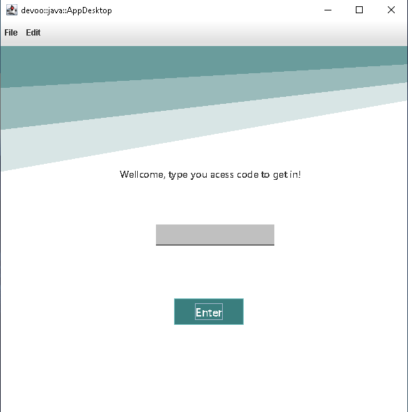

# 🔥 ⚡ Aplicativo Desktop  💥 ☀

#### Dessa vez estou a treinar criacao de programas completos com interfaces graficas em java, nesse projecto fiz um softwere de gestao escolar, usando um banco de dados pouco usado, mas eficiente e simples, o SQLite.


>***⚠ Atencao:***
>>**Nao 'e recomendavel o uso do SQLite para armazenameto e manipulacao de grandes vulumes de informacao**

>>** O PROJECO ESTA EM PRODUCAO**
>>MAS SE QUISER FAZER TESTE, CONTRIBUIR OU USAR PARA OUTRO FIM, FIQUE AVONTADE E SIGA OS PASSOS ABAIXO
---

---

#### INSTALACAO

**requisitos**
    
    - Git
    - Java SDK-21 ou superior
    - JVM [OPCIONAL]

*Siga esses passos para construir o jar*

*clone o repositorio git!*

```
    git clone https://github.com/fernando-vunge/app_desktop.git
```

*entre na pasta!*

```
    cd app_desktop/
```
*e rode o seguinte comando para criar o bytecode e jat!*

```
	#para contruir os binarios
	javac -d bin -sourcepath src src/**/*.java
	
	#para contruir o jar
	jar cvfm app.jar manifest.txt -C bin .
	
```


---

#### EXECUCAO

*execute o ficheiro game.py*

Se voce tiver o JVM devidamente instalado no seu PC, basta clicar no arquivo **app.jar**

Caso nao tenha, execute pela linha de comando (Git BASH [Opcional])

```
    java -jar app.jar
```
---



---

